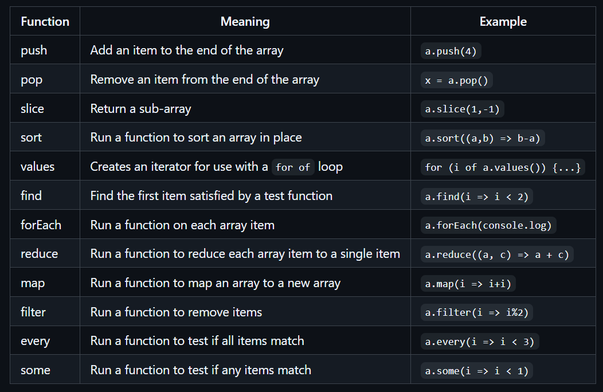

Things learned
---------------------------------------

GitHub
---------------------------------------
I became much more familiar w/the basics of Github. It's quite simple (shown below)
Steps to use Github:
1) Verify you have the latest code (git pull)
2) Refactor, test, and/or implement a small portion of cohesive code (test code test)
3) Commit and push (git commit git push)
4) Repeat

---------------------------------------
Deploying a website
---------------------------------------
syntax: deployFiles.sh -k <pem key file> -h <hostname> -s <service>
You need a fairly complex file (deployFiles.sh) to deploy a website. Unsure of how this is made. It seems like the type of thing that can be auto-generated.
---------------------------------------

Extensions of your domain:
---------------------------------------
    In order to allow something like extension.yourdomain.com you need to create an A record that looks like *.yourdomain.com and then you can create any extension you want following that pattern

---------------------------------------

<!DOCTYPE html>
<html lang="en">
<head>
    <meta charset="UTF-8">
    <meta name="viewport" content="width=device-width, initial-scale=1.0">
    <title>GPT-Notes -- Login</title>
    <link
      href="https://cdn.jsdelivr.net/npm/bootstrap@5.2.3/dist/css/bootstrap.min.css"
      rel="stylesheet"
      integrity="sha384-rbsA2VBKQhggwzxH7pPCaAqO46MgnOM80zW1RWuH61DGLwZJEdK2Kadq2F9CUG65"
      crossorigin="anonymous"
    />
    <link rel="stylesheet" href="css/main.css">
</head>

<body class="body-home">
    <header>
        <nav>
        </nav>
    </header>
    <main>
        <section>
            

            

        </section>
    </main>
</body>

Flex-box
---------------------------------------
- You can simply make an element a flex box by giving it that property; this allows your elements to be dynamically changed in size, shape, etc. for different window sizes
- You can also make conditional CSS rules that apply when certain "@media" query conditions are met, like the max-size of window for the current device

Bootstrap
---------------------------------------
I've often heard of Bootstrap, but I didn't really know what it was.
- you can import CSS rules that conform to a certain look
- these include advanced web elements like accordion features. I also learned about how JS works to make buttons do certain things (like open up an accordion); it is important to give elements id's so that they can be referenced by other elements (like buttons) to do this sort of thing.

CSS
---------------------------------------
I did pretty much this entire website without Bootstrap in not a lot of time (6-7 hours), and while it does follow Bootstrap themes (I think), it has it's own vibe and I enjoyed doing it (as annoying as getting spacing stuff right is sometimes). I didn't do anything as crazy as an accordion, though, so there is that.

Making text elements reizable (and containers in general) is a lot easier than I thought; it just adds a square in the bottom right if you say resize: both (or horizontal or vertical).

Chat GPT is a good place to go to get the right color; just describe what you want in the color, ask for examples in hexidecimal, and then test them all out. You can narrow your search as you go along, asking for something more like this or that. Very great.

Making stuff responsive to screen size is not difficult either; see main.css for simple example.

SASS is awesome; @extend .your-class is super useful and really helps make the scss file a lot cleaner, as well as faster to make. When coding, just type sass --watch css/main.scss:css/main.css and it will re-compile the css file to match what you did in the scss file every time you save changes.

Other:
Ports 443, 80, 22 are reserved for which protocols?
Port 443: HTTPS, Port 80: HTTP, Port 22: SSH.

- Flex Container Properties
These properties are applied to the parent (container) to control the layout of its children (flex items).

flex-direction

Defines the direction in which the flex items are placed in the flex container.
row (default): Items are placed in a row (horizontally).
row-reverse: Items are placed in a row, but in reverse order.
column: Items are placed in a column (vertically).
column-reverse: Items are placed in a column, but in reverse order.
justify-content

Aligns flex items along the main axis (horizontally in row and vertically in column).
flex-start: Items are aligned at the start of the container.
flex-end: Items are aligned at the end of the container.
center: Items are centered along the main axis.
space-between: Items are evenly distributed, with the first item at the start and the last item at the end.
space-around: Items are evenly distributed with space around them.
space-evenly: Items are evenly distributed with equal space around all items.
align-items

Aligns flex items along the cross axis (vertically in row, horizontally in column).
stretch (default): Items stretch to fill the container.
flex-start: Items are aligned at the start of the cross axis.
flex-end: Items are aligned at the end of the cross axis.
center: Items are centered along the cross axis.
baseline: Items are aligned along their text baselines.
align-content

Controls the alignment of flex lines when there is extra space in the cross axis (when flex items wrap onto multiple lines).
flex-start: Lines are packed toward the start of the container.
flex-end: Lines are packed toward the end of the container.
center: Lines are packed in the center.
space-between: Lines are evenly distributed with no space at the edges.
space-around: Lines are evenly distributed with space around them.
stretch: Lines stretch to fill the remaining space.
flex-wrap

Controls whether flex items are forced onto one line or can wrap onto multiple lines.
nowrap (default): All items are placed in a single line.
wrap: Items wrap onto multiple lines if needed.
wrap-reverse: Items wrap onto multiple lines, but in reverse order.

JavaScript
---------------------------------------

Objects:
Correct syntax for creating a JavaScript object?
let obj = { key: value };

Functions:
valid:
function f(x) = {} X
const f = (x) => {} O
function f(x) {} O
const f = function(x) {} O

if (condition) { ... } else { ... }
for (let i = 0; i < n; i++) { ... }
while (condition) { ... }
switch (expression) { ... }

- Arrays:
const a = [1, 2, 3];
console.log(a[1]);
// OUTPUT: 2

console.log(a.length);
// OUTPUT: 3

Array functions:

const a = [1, 2, 3];

console.log(a.map((i) => i + i));
// OUTPUT: [2,4,6]
console.log(a.reduce((v1, v2) => v1 + v2));
// OUTPUT: 6
console.log(a.sort((v1, v2) => v2 - v1));
// OUTPUT: [3,2,1]

a.push(4);
console.log(a.length);
// OUTPUT: 4

Tag to include JavaScript on an HTML page?

- The DOM:

- The DOM supports the ability to insert, modify, or delete the elements in the DOM. To create a new element you first create the element on the DOM document. You then insert the new element into the DOM tree by appending it to an existing element in the tree.

function insertChild(parentSelector, text) {
  const newChild = document.createElement('div');
  newChild.textContent = text;

  const parentElement = document.querySelector(parentSelector);
  parentElement.appendChild(newChild);
}

insertChild('#courses', 'new course');

- To delete elements call the removeChild function on the parent element.

function deleteElement(elementSelector) {
  const el = document.querySelector(elementSelector);
  el.parentElement.removeChild(el);
}

deleteElement('#courses div');

- The DOM also allows you to inject entire blocks of HTML into an element. The following code finds the first div element in the DOM and replaces all the HTML it contains.

const el = document.querySelector('div');
el.innerHTML = '
<b>Hello</b>!
';

- If you are injecting HTML, make sure that it cannot be manipulated by a user. Common injection paths include HTML input controls, URL parameters, and HTTP headers. Either sanitize any HTML that contains variables, or simply use DOM manipulation functions instead of using innerHTML.

- All DOM elements support the ability to attach a function that gets called when an event occurs on the element. These functions are called event listeners. Here is an example of an event listener that gets called when an element gets clicked.

- All DOM elements support the ability to attach a function that gets called when an event occurs on the element. These functions are called event listeners. There are lots of possible events that you can add a listener to. This includes things like mouse, keyboard, scrolling, animation, video, audio, WebSocket, and clipboard events. You can see the full list on MDN. Here are a few of the more commonly used events. 
Here is an example of an event listener that gets called when an element gets clicked.

const submitDataEl = document.querySelector('#submitData');
submitDataEl.addEventListener('click', function (event) {
  console.log(event.type);
});

You can also add event listeners directly in the HTML. For example, here is a onclick handler that is attached to a button.

<button onclick='alert("clicked")'>click me</button>

- Promises:
The execution of a promise allows the main rendering thread to continue while some action is executed in the background.
You create a promise by calling the Promise object constructor and passing it an executor function that runs the asynchronous operation. Executing asynchronously means that promise constructor may return before the promise executor function runs.

The state of the promise execution is always in one of three possible states:
pending - Currently running asynchronously
fulfilled - Completed successfully
rejected - Failed to complete

We can demonstrate asynchronous execution by using the standard JavaScript setTimeout function to create a delay in the execution of the code. The setTimeout function takes the number of milliseconds to wait and a function to call after that amount of time has expired. We call the delay function in a for loop in the promise executor and also in a for loop outside the promise so that both code blocks are running in parallel.

const delay = (msg, wait) => {
  setTimeout(() => {
    console.log(msg, wait);
  }, 1000 * wait);
};

new Promise((resolve, reject) => {
  // Code executing in the promise
  for (let i = 0; i < 3; i++) {
    delay('In promise', i);
  }
});

// Code executing after the promise
for (let i = 0; i < 3; i++) {
  delay('After promise', i);
}

// OUTPUT:
//   In promise 0
//   After promise 0
//   In promise 1
//   After promise 1
//   In promise 2
//   After promise 2

The promise executor function takes two functions as parameters, resolve and reject. Calling resolve sets the promise to the fulfilled state, and calling reject sets the promise to the rejected state.

With the ability to asynchronously execute and set the resulting state, we now need a way to generically do something with the result of a promise after it resolves. This is done with functionality similar to exception handling. The promise object has three functions: then, catch, and finally. The then function is called if the promise is fulfilled, catch is called if the promise is rejected, and finally is always called after all the processing is completed.

We can rework our coinToss example and make it so 10 percent of the time the coin falls off the table and resolves to the rejected state. Otherwise the promise resolves to fulfilled with a result of either heads or tails.

const coinToss = new Promise((resolve, reject) => {
  setTimeout(() => {
    if (Math.random() > 0.1) {
      resolve(Math.random() > 0.5 ? 'heads' : 'tails');
    } else {
      reject('fell off table');
    }
  }, 10000);
});

coinToss
  .then((result) => console.log(`Coin toss result: ${result}`))
  .catch((err) => console.log(`Error: ${err}`))
  .finally(() => console.log('Toss completed'));

// OUTPUT:
//    Coin toss result: tails
//    Toss completed

- Async Await
JavaScript Promise objects are great for asynchronous execution, but as developers began to build large systems with promises they started wanting a more concise representation. This was provided with the introduction of the async/await syntax. The await keyword wraps the execution of a promise and removed the need to chain functions. The await expression will block until the promise state moves to fulfilled, or throws an exception if the state moves to rejected. For example, if we have a function that returns a coin toss promise.

const coinToss = () => {
  return new Promise((resolve, reject) => {
    setTimeout(() => {
      if (Math.random() > 0.1) {
        resolve(Math.random() > 0.5 ? 'heads' : 'tails');
      } else {
        reject('fell off table');
      }
    }, 1000);
  });
};

async, try/catch version (implementing the coinToss function):
try {
  const result = await coinToss();
  console.log(`Toss result ${result}`);
} catch (err) {
  console.error(`Error: ${err}`);
} finally {
  console.log(`Toss completed`);
}

One important restriction for working with await is that you cannot call await unless it is called at the top level of the JavaScript, or is in a function that is defined with the async keyword. Applying the async keyword transforms the function so that it returns a promise that will resolve to the value that was previously returned by the function. Basically this turns any function into an asynchronous function, so that it can in turn make asynchronous requests.

Ex:
function cow() {
  return 'moo';
}
console.log(cow());
// OUTPUT: moo

If we designate the function to be asynchronous then the return value becomes a promise that is immediately resolved and has a value that is the return value of the function.

async function cow() {
  return 'moo';
}
console.log(cow());
// OUTPUT: Promise {<fulfilled>: 'moo'}

We then change the cow function to explicitly create a promise instead of the automatically generated promise that the await keyword generates.

async function cow() {
  return new Promise((resolve) => {
    resolve('moo');
  });
}
console.log(cow());
// OUTPUT: Promise {<pending>}

You can see that the promise is in the pending state because the promise's execution function has not yet resolved.

await:
The async keyword declares that a function returns a promise. The await keyword wraps a call to the async function, blocks execution until the promise has resolved, and then returns the result of the promise.

The async keyword declares that a function returns a promise. The await keyword wraps a call to the async function, blocks execution until the promise has resolved, and then returns the result of the promise.

We can demonstrate await in action with the cow promise from above. If we log the output from invoking cow then we see that the return value is a promise. However, if we prefix the call to the function with the await keyword, execution will stop until the promise has resolved, at which point the result of the promise is returned instead of the actual promise object.
ex:
console.log(cow());
// OUTPUT: Promise {<pending>}

console.log(await cow());
// OUTPUT: moo

Combining async / await:
You can see the benefit for async/await clearly by considering a case where multiple promises are required. For example, when calling the fetch web API on an endpoint that returns JSON, you would need to resolve two promises. One for the network call, and one for converting the result to JSON. A promise implementation would look like the following.

Lame way:

const httpPromise = fetch('https://simon.cs260.click/api/user/me');
const jsonPromise = httpPromise.then((r) => r.json());
jsonPromise.then((j) => console.log(j));
console.log('done');

// OUTPUT: done
// OUTPUT: {email: 'bud@mail.com', authenticated: true}

Epic way:

With async/await, you can clarify the code intent by hiding the promise syntax, and also make the execution block until the promise is resolved:

const httpResponse = await fetch('https://simon.cs260.click/api/user/me');
const jsonResponse = await httpResponse.json();
console.log(jsonResponse);
console.log('done');

// OUTPUT: {email: 'bud@mail.com', authenticated: true}
// OUTPUT: done